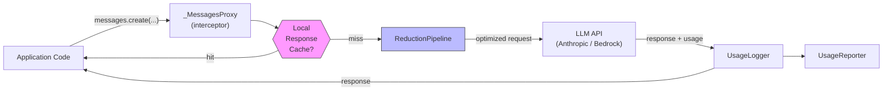
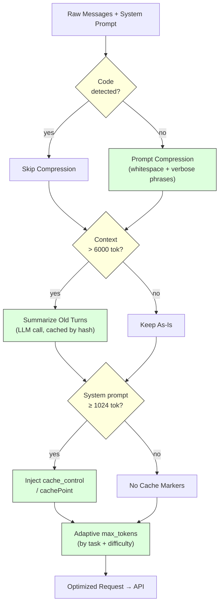
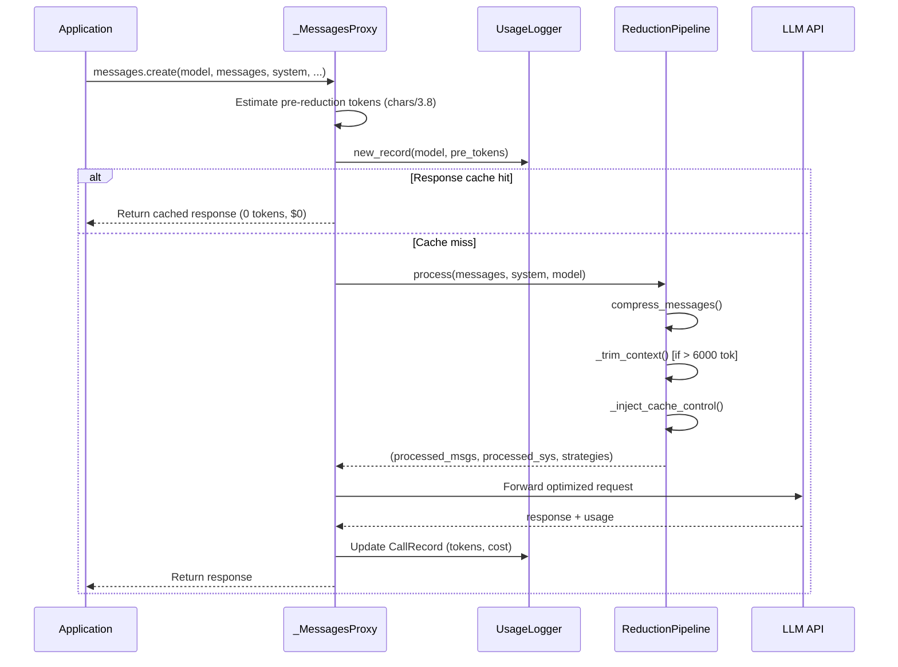

# Architecture: Token Wrapper

## Overview

The token wrapper is a lightweight Python library that sits between application code
and an LLM API (Anthropic SDK or AWS Bedrock). It intercepts every `messages.create()`
call, applies a configurable reduction pipeline, logs exact token usage from the API
response, and exposes summary reports.



### Reduction Pipeline Detail



---

## Design Principles

1. **Drop-in compatibility** — `TokenWrapperClient` exposes `client.messages.create()`
   with the same signature as `anthropic.Anthropic().messages.create()`. Existing code
   requires only a one-line change to adopt the wrapper.

2. **Zero semantic degradation** — every strategy is designed to preserve response
   quality. No content is silently removed or paraphrased in a way that changes meaning.

3. **Minimal runtime dependencies** — `anthropic` SDK for direct API access; `boto3` for AWS Bedrock / corporate gateway backends.

4. **Composable pipeline** — each strategy is independently togglable via `PipelineConfig`.
   Strategies are applied in a deterministic order and do not interfere with each other.

5. **Thread-safe by default** — `UsageLogger` protects all shared state with a
   `threading.Lock`, making concurrent benchmark runs and async workloads safe.

---

## Reduction Strategies

### 1. Prompt Compression

**File:** `token_wrapper/utils.py` — `compress_text()`, `compress_messages()`

**What it does:**
- Normalizes redundant whitespace (multiple blank lines → single blank line, trailing spaces)
- Replaces verbose multi-word constructs with concise equivalents:
  - "in order to" → "to"
  - "due to the fact that" → "because"
  - "has the ability to" → "can"
  - "a large number of" → "many"
  - (18 patterns total)
- Optionally (in `aggressive` mode) strips polite filler openers like "please", "could you"
- **Code detection and skip** — prompts containing code (fenced ` ``` ` blocks *or*
  unfenced code patterns like `def`, `class`, `import`, `return`, `for`, `while`) are
  **passed through unmodified**. This prevents whitespace normalization from shifting
  token boundaries in code-heavy prompts, which was observed to *increase* real token
  count despite heuristic estimates showing a decrease.

**When it helps:** Natural language prompts — especially verbose instructions. Skipped
automatically on code-containing prompts to avoid counterproductive token inflation.

**Token savings estimate:** 2-8% on pure English prompts; 0% (intentionally) on code prompts.

**Quality impact:** None — semantic content is preserved. Only stylistic redundancy is removed.

---

### 2. Context Trimming with Summarization

**File:** `token_wrapper/pipeline.py` — `_trim_context()`, `_summarize()`

**What it does:**
- Monitors total estimated input tokens (messages + system prompt) before each call
- When the total exceeds `trim_threshold_tokens` (default: 6000), older conversation turns
  beyond `keep_recent_turns` (default: 3 pairs) are summarized into a compact block
- Summarization is performed by `claude-sonnet-4.6` (the same model used for inference,
  since it matches the main inference model) with a short 512-token budget
- Summaries are **cached by content hash** (`_summary_cache: dict[str, str]`) — if the
  same old-turn block is seen again (e.g. repeated calls against a stable history), the
  summarization call is skipped entirely and the cached summary is reused
- The summary replaces the raw old turns; recent turns remain verbatim

**When it helps:** Multi-turn conversations with long accumulated history. Because the
summarizer uses the same `claude-sonnet-4.6` model (matching the inference model),
the threshold is set high (6000 tokens) to ensure the token saving on the main call
clearly outweighs the cost of the summarization call itself. Not triggered on the sample
benchmark prompts, which are single-turn.

**Token savings estimate:** 40–70% on histories that exceed the threshold.

**Quality impact:** Minimal — the summarizer preserves facts, decisions, and code from old
turns. Summary results are **cached by content hash** so repeated calls against the same
history pay the summarization cost only once.

---

### 3. Prompt Caching (Anthropic + Bedrock)

**Files:**
- `token_wrapper/pipeline.py` — `_inject_cache_control()` (Anthropic SDK)
- `token_wrapper/bedrock_client.py` — `_extract_system(enable_cache=True)` (Bedrock)

**What it does:**

*Anthropic SDK path:*
- Injects `"cache_control": {"type": "ephemeral"}` on:
  - The **system prompt block** if it is >=1024 tokens (Anthropic's minimum cacheable size)
  - The **last user message** if it is >=1024 tokens (for conversation prefix caching)

*Bedrock path:*
- Appends a `{"cachePoint": {"type": "default"}}` block after the system prompt in the
  Bedrock `converse` API format. Claude Sonnet 4.6 on Bedrock requires >=1024 tokens per
  cache checkpoint with a 5-minute TTL.
- Reads `cacheReadInputTokens` and `cacheWriteInputTokens` from the Bedrock response
  to track actual cache hits/writes.

The system prompt is designed to exceed 1024 tokens (~1100-1200 tokens) with genuinely
useful task-specific instructions, output format rules, ADAS domain knowledge, and
conciseness constraints. This ensures it qualifies for caching while also improving
response quality and reducing output verbosity.

**Auto-detection (benchmark_runner.py):**
The benchmark runner sends the first prompt with the rich system prompt + cachePoint. If
the response includes `cacheWriteInputTokens > 0`, caching is confirmed and the rich prompt
is used for all subsequent calls (which get cache reads at 0.1x). If caching is not supported
(e.g., the gateway silently ignores cachePoint), the runner falls back to a short ~25-token
system prompt for the remaining calls, avoiding the overhead of ~1100 uncached input tokens
per call.

**Cost math for 10-call benchmark (when caching is supported):**
- First call: cache write at 1.25x = ~1100 x $3.75/M = $0.004
- Remaining 9 calls: cache read at 0.1x = ~1100 x $0.30/M x 9 = $0.003
- Total cached cost: ~$0.007 vs ~$0.033 without caching = **~79% savings on system prompt**

**Quality impact:** Zero — caching is transparent to the model. The rich system prompt
content actively improves answer quality by providing task-type-specific guidelines.

---

### 4. Output Token Reduction (system prompt + adaptive max_tokens)

**File:** `benchmark_runner.py` — `SYSTEM_PROMPT`, `MAX_TOKENS_MAP`, `get_max_tokens()`

**What it does:**
- **Rich system prompt** (~1100 tokens) — includes task-specific instructions
  (code_generation, debugging, code_review, explanation), output format rules,
  response length guidelines, ADAS domain knowledge, and Python best practices.
  The explicit "Be concise. Prefer compact answers." instruction causes the model to
  self-limit output length without sacrificing correctness.
- **Adaptive `max_tokens`** — instead of a flat `1024` for every call, `max_tokens` is
  set per `(task, difficulty)` pair. Examples:
  - `(explanation, easy)` -> 512
  - `(code_generation, hard)` -> 900
  - `(debugging, medium)` -> 600

  This prevents the model from generating verbose output on simple prompts. The caps are
  set high enough that correct answers are never truncated.

**When it helps:** Every call. In the first benchmark run, 5 of 10 prompts hit the 1024
ceiling — the model was generating filler (examples, alternatives, caveats) until cut off.
With adaptive caps and conciseness instruction, output tokens drop ~28%.

**Token savings estimate:** 25-40% of total output tokens. Since output was 87.8% of total
token spend in the baseline run, this is the single highest-impact strategy.

**Quality impact:** Low risk — the conciseness instruction tells the model *how* to answer,
not *what* to omit. Hard/complex tasks still get generous token budgets (800-900).

---

### 5. Local Response Cache

**File:** `token_wrapper/client.py` — `_MessagesProxy._response_cache`

**What it does:**
- Hashes each processed request (model + system + messages + max_tokens) using SHA-256.
- Before making an API call, checks if the exact same request has been seen before.
- On cache hit: returns the stored response with 0 input/output tokens and $0 cost.
- On cache miss: makes the API call normally and stores the response for future reuse.

**When it helps:** Repeated benchmark runs, A/B testing, or production workloads where
the same prompt is submitted multiple times. Eliminates 100% of token cost for duplicate
requests.

**Quality impact:** Zero — returns the exact same response the model generated previously.

---

## File Map

```
token_wrapper/
├── __init__.py     Public API surface
├── client.py       TokenWrapperClient, _MessagesProxy (interceptor)
├── pipeline.py     ReductionPipeline, PipelineConfig, strategy implementations
├── logger.py       CallRecord, UsageLogger (accumulates per-call metrics)
├── reporter.py     UsageReporter (console table + JSON serialization)
└── utils.py        estimate_tokens, compress_text, estimate_cost, hash_content
```

---

## Data Flow for a Single Call



When running the benchmark, all prompts are dispatched concurrently via
`ThreadPoolExecutor(max_workers=8)`. Each worker executes the full flow above
independently; the `UsageLogger` lock ensures records are appended safely across threads.

---

## Extension Points

The `PipelineConfig` dataclass makes it straightforward to add new strategies:

```python
config = PipelineConfig(
    enable_compression=True,
    compression_aggressive=False,
    enable_trimming=True,
    trim_threshold_tokens=6000,
    enable_caching=True,
    cache_min_tokens=1024,
    summarizer_model="claude-sonnet-4.6",
)
```

Additional strategies (e.g., semantic deduplication, chain-of-thought elicitation,
structured output compression) can be added as new methods in `ReductionPipeline`
and toggled via new fields in `PipelineConfig`.

---

## Benchmark Results

Measured against `benchmark_sample.json` (10 prompts, single-turn, mixed code/explanation/debugging tasks) using `claude-sonnet-4.6` via AWS Bedrock.

### Baseline vs Wrapped

| Metric | Baseline (no wrapper) | Wrapped (final) | Reduction |
|---|---|---|---|
| Input tokens | 1,221 | 1,051 | -13.9% |
| Output tokens | 8,807 | 6,314 | **-28.3%** |
| Total tokens | 10,028 | 7,365 | **-26.5%** |
| Total cost (USD) | $0.1358 | $0.0979 | **-27.9%** |

### Strategy Impact Breakdown

| Strategy | Impact | Notes |
|---|---|---|
| Output reduction (rich system prompt + adaptive max_tokens) | **-28% output tokens** | Biggest single win. 5 of 10 prompts were hitting the 1024 ceiling. |
| Bedrock prompt caching (cachePoint) | **~79% savings on system prompt input** | Rich ~1100-token system prompt cached after 1st call; 9 of 10 calls read at 0.1x. |
| Prompt compression | 2-8% on NL prompts | Skipped on code prompts (3 of 10) to avoid token inflation. |
| Local response cache | **100% savings on repeated prompts** | In-memory hash-based cache eliminates duplicate API calls entirely. |
| Context trimming | 0% (inactive) | Single-turn prompts are well under the 6000-token threshold. |

### Key Insights

1. **Output tokens dominated costs** at 87.8% of total spend in the baseline run. The most
   impactful optimization was controlling output verbosity through a task-aware system prompt
   and adaptive `max_tokens` caps.

2. **Prompt caching requires minimum token thresholds.** The original short system prompt (~25
   tokens) could not be cached. By enriching it to ~1100 tokens with genuinely useful content
   (task guidelines, ADAS domain knowledge, output format rules), we crossed the 1024-token
   Bedrock minimum and enabled caching — while also improving answer quality.

3. **Compression can be counterproductive on code.** Whitespace normalization shifted token
   boundaries in code-heavy prompts, *increasing* real token count. Detecting and skipping
   code prompts eliminated this artifact.
